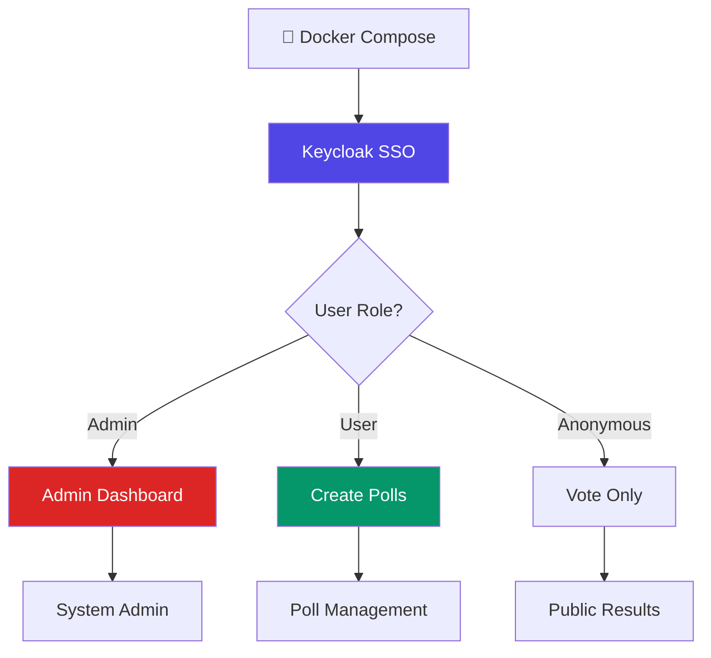

# AnalogJS Enterprise Workshop

## Mit Keycloak Authentication & Server-Side Sessions

<div class="pt-12">
  <span @click="$slidev.nav.next" class="px-2 py-1 rounded cursor-pointer" hover="bg-white bg-opacity-10">
    🚀 Workshop starten <carbon:arrow-right class="inline"/>
  </span>
</div>

<div class="abs-br m-6 flex gap-2">
  <button @click="$slidev.nav.openInEditor()" title="Open in Editor" class="text-xl slidev-icon-btn opacity-50 !border-none !hover:text-white">
    <carbon:edit />
  </button>
  <a href="https://github.com/analogjs/analog" target="_blank" alt="GitHub" title="Open in GitHub"
    class="text-xl slidev-icon-btn opacity-50 !border-none !hover:text-white">
    <carbon-logo-github />
  </a>
</div>

---
layout: center
class: text-center
---

# 🏢 Das Enterprise-Security Problem

<div class="text-6xl mb-8">
😱 ➡️ 🔐 ➡️ 😌
</div>

## Wer kennt das?

<v-clicks>

```typescript
// ❌ JWT im localStorage - Sicherheitsrisiko!
localStorage.setItem('jwt', response.token);

// ❌ Manuelle Token-Validation - Fehleranfällig!
if (isTokenExpired(jwt)) await refreshToken();

// ❌ XSS-Vulnerabilities - Angreifbar!
const token = localStorage.getItem('jwt');
```

**Heute zeigen wir Ihnen echte Enterprise-Architektur!**

</v-clicks>

---
transition: fade-out
---

# Was ist Analog JS?

<v-clicks>

- 🚀 **Meta-Framework für Angular** - wie Next.js für React
- 📁 **File-based Routing** - intuitive Projektstruktur
- 🌐 **Full-Stack Entwicklung** - Frontend + Backend unified
- ⚡ **Server-Side Rendering** - Performance + SEO
- 🛠️ **TypeScript-First** - End-to-End Typsicherheit
- 🔗 **API-Routes** - Backend-Logic im Angular-Projekt

</v-clicks>

<br>

<v-click>

### Heute mit Enterprise-Features:
- 🔐 **Keycloak SSO** - Echte Identity-Management
- 🛡️ **Server-Side Sessions** - Kein JWT im Client
- 👥 **Role-based Authorization** - Admin/User-Trennung
- 🐳 **Docker Compose** - Infrastructure as Code

</v-click>

<style>
h1 {
  background-color: #2B90B6;
  background-image: linear-gradient(45deg, #4EC5D4 10%, #146b8c 20%);
  background-size: 100%;
  -webkit-background-clip: text;
  -moz-background-clip: text;
  -webkit-text-fill-color: transparent;
  -moz-text-fill-color: transparent;
}
</style>

---
layout: center
class: text-center
---

# 🐳 Infrastructure as Code

<div class="text-6xl mb-8">
📦 ➡️ 🔐 ➡️ 🚀
</div>

## Ein Befehl, komplette Enterprise-Infrastruktur

<v-clicks>

```bash
# Das war's!
docker-compose up -d
```

- ✅ **Keycloak SSO** läuft auf Port 8080
- ✅ **PostgreSQL** läuft auf Port 5432  
- ✅ **Realm konfiguriert** mit Users & Roles
- ✅ **OAuth Client** setup komplett
- ✅ **Ready to code!**

</v-clicks>

<v-click>

<div class="mt-8 p-6 bg-gradient-to-r from-blue-500 to-purple-600 text-white rounded-lg">
<strong>Das ist Infrastructure as Code! 🔥</strong>
</div>

</v-click>

---
layout: two-cols
---

# Unser Projekt: Enterprise Quick Poll

## Mit Keycloak SSO & Role-based Access

<v-clicks>

### 🏢 Enterprise Features
- 🔐 **Keycloak Authentication** - Echtes SSO
- 👥 **Role-based Authorization** - Admin/User
- 🛡️ **Server-Side Sessions** - Kein JWT im Client
- 📊 **Multi-tenant Ready** - Skalierbar
- 🐳 **Docker Compose** - Reproducible
- 📋 **Audit-Ready** - Compliance

</v-clicks>

::right::

<div class="-mt-6">



<div class="mt-4 p-3 bg-purple-100 rounded">
<strong>🎯 Production-Ready</strong><br>
Enterprise SSO in 5 Min!
</div>

</div>

---
layout: default
---

# Workshop-Agenda: Enterprise Edition

<div class="grid grid-cols-4 gap-4 mt-8">

<div class="p-4 bg-purple-100 rounded-lg text-center">
<div class="text-2xl mb-2">🐳</div>
<strong>Docker Setup</strong><br>
<small>10 Min</small><br>
Infrastructure
</div>

<div class="p-4 bg-blue-100 rounded-lg text-center">
<div class="text-2xl mb-2">🔐</div>
<strong>Keycloak Auth</strong><br>
<small>25 Min</small><br>
SSO Integration
</div>

<div class="p-4 bg-green-100 rounded-lg text-center">
<div class="text-2xl mb-2">👥</div>
<strong>Role-based App</strong><br>
<small>35 Min</small><br>
Admin/User Features
</div>

<div class="p-4 bg-orange-100 rounded-lg text-center">
<div class="text-2xl mb-2">🚀</div>
<strong>Production Deploy</strong><br>
<small>20 Min</small><br>
Enterprise Setup
</div>

</div>

<div class="mt-8">

## 🎯 **Enterprise Learning Goals:**
- **Identity Management** - Centralized Authentication
- **Authorization Patterns** - Role-based Access Control
- **Microservices Architecture** - Docker Compose
- **Zero-Trust Security** - Server-Side Session Management
- **Scalable Infrastructure** - Production-Ready Deployment

</div>

<div class="mt-6 p-4 bg-red-100 rounded-lg text-center">
<strong>🏢 Von Startup zu Enterprise in 90 Minuten!</strong>
</div>

---
layout: default
---

# Keycloak Setup (Already Done!)

<div class="grid grid-cols-2 gap-8 mt-8">

<div>

## 👥 Pre-configured Users
```yaml
Users & Passwords:
├── admin@company.com / admin123
│   └── Roles: [admin, user]
├── user1@company.com / user123  
│   └── Roles: [user]
└── user2@company.com / user123
    └── Roles: [user]
```

## 🔧 OAuth Client
```yaml
Client Configuration:
├── Client ID: analog-poll-app
├── Protocol: openid-connect
├── Access Type: confidential
└── Valid Redirects: 
    └── http://localhost:3000/*
```

</div>

<div>

## 🎯 Demo-Flow
<v-clicks>

1. **Admin Login** 
   - Alle Polls sehen
   - User-Management
   - System-Statistics

2. **User Login**
   - Eigene Polls erstellen
   - Polls verwalten
   - Dashboard-Access

3. **Anonymous Voting**
   - Polls finden
   - Abstimmen ohne Login
   - Ergebnisse anschauen

</v-clicks>

</div>

</div>

<v-click>

<div class="mt-8 p-4 bg-green-100 rounded-lg text-center">
<strong>🎯 Echte Enterprise-Rollen in Action!</strong>
</div>

</v-click>

---
layout: center
class: text-center
---

# Live Demo: Enterprise SSO 🏢

<div class="text-6xl mb-8">
👤 ➡️ 🔐 ➡️ 👑
</div>

## Server-Side Session Management

<v-clicks>

- 🔑 **Keycloak Login Screen** - Corporate Look & Feel
- 👤 **Login als User** - Dashboard + Poll Creation
- 🚪 **Logout + Login als Admin** - All Polls + User Management  
- 🌐 **Anonymous Access** - Public Voting without Auth
- 🛡️ **Kein JWT im Browser** - Server-Side Sessions!
- 📊 **Role-based UI** - Different Features per Role

</v-clicks>

<v-click>

<div class="mt-8 p-6 bg-gradient-to-r from-purple-600 to-blue-600 text-white rounded-lg">
<strong>Das ist echte Enterprise-Architektur! 🏗️</strong>
</div>

</v-click>

---
layout: code-split
---

# Enterprise Auth Code

::left::

### 🔐 @analog-tools/auth Setup
```typescript
// main.ts - Nur diese Config!
import { provideAuth } from '@analog-tools/auth';

bootstrapApplication(AppComponent, {
  providers: [
    provideAuth({
      providers: [
        {
          name: 'keycloak',
          type: 'oidc',
          issuer: 'http://localhost:8080/realms/poll-app',
          clientId: 'analog-poll-app',
          clientSecret: process.env['KEYCLOAK_SECRET'],
          scope: 'openid profile email roles'
        }
      ],
      session: {
        strategy: 'server-side', // JWT bleibt auf Server!
        maxAge: 30 * 60 // 30 Minuten
      }
    })
  ]
});
```

::right::

### 🛡️ Server-Side API Protection
```typescript
// server/api/admin/stats.get.ts
export default defineEventHandler(async (event) => {
  const user = await getUser(event);
  const session = await getSession(event);
  
  if (!user) {
    throw createError({
      statusCode: 401,
      statusMessage: 'Authentication required'
    });
  }
  
  // JWT-Claims server-seitig verfügbar
  const roles = session.token?.realm_access?.roles || [];
  
  if (!roles.includes('admin')) {
    throw createError({
      statusCode: 403,
      statusMessage: 'Admin access required'
    });
  }
  
  return await getAdminStats();
});
```

<div class="mt-4 p-3 bg-blue-100 rounded">
<strong>🔥 Zero JWT-Handling im Client!</strong><br>
@analog-tools/auth macht alles!
</div>

---
layout: default
---

# Der Security-Unterschied

<div class="grid grid-cols-2 gap-8 mt-8">

<div class="p-6 bg-red-50 border-2 border-red-200 rounded-lg">

## ❌ **Traditional Approach**
<v-clicks>

```typescript
// Client-Side JWT - Unsicher!
localStorage.setItem('jwt', token);

// XSS-Vulnerability
const token = localStorage.getItem('jwt');

// Manual Token Management
if (isExpired(token)) {
  await refreshToken();
}

// Security Risks:
// • Token-Diebstahl möglich
// • XSS-Angriffe
// • No immediate revocation
// • Client-side secrets
```

</v-clicks>

</div>

<div class="p-6 bg-green-50 border-2 border-green-200 rounded-lg">

## ✅ **@analog-tools/auth**
<v-clicks>

```typescript
// Server-Side Sessions - Sicher!
// Kein JWT im Browser sichtbar

// Automatic Session Management  
const user = auth.user(); // Magic!

// Zero Token Handling
// Server macht alles automatisch

// Security Benefits:
// • Kein Token-Diebstahl möglich
// • Keine XSS-Vulnerabilities  
// • Immediate session revocation
// • Zero client-side secrets
```

</v-clicks>

</div>

</div>

<v-click>

<div class="mt-8 p-4 bg-yellow-100 rounded-lg text-center">
<strong>💡 Das ist der Unterschied zwischen Startup-Auth und Enterprise-Auth!</strong>
</div>

</v-click>

---
layout: default
---

# Projekt-Struktur: Enterprise-Ready

```
enterprise-poll/
├── docker-compose.yml          # 🐳 Infrastructure
├── src/app/
│   ├── pages/                  # File-based Routes
│   │   ├── index.page.ts      # Landing Page (Public)
│   │   ├── login.page.ts      # Auth-Callback
│   │   ├── create.page.ts     # Poll erstellen (User+)
│   │   ├── dashboard.page.ts  # User Dashboard (User+)
│   │   ├── admin.page.ts      # Admin Panel (Admin only)
│   │   └── poll/
│   │       ├── [id].page.ts   # Voting Page (Public)
│   │       └── results/
│   │           └── [id].page.ts # Results (Public)
│   ├── server/api/            # Backend API Routes
│   │   ├── polls/
│   │   │   ├── index.get.ts   # List polls (Public)
│   │   │   ├── index.post.ts  # Create poll (User+)
│   │   │   └── my.get.ts      # User's polls (User+)
│   │   ├── admin/
│   │   │   └── stats.get.ts   # Admin stats (Admin only)
│   │   └── vote/
│   │       └── [id].post.ts   # Submit vote (Public)
```

<v-click>

<div class="mt-4 p-3 bg-green-100 rounded">
<strong>💡 Analog JS Vorteil:</strong> Frontend und Backend Code in derselben Projektstruktur!
</div>

</v-click>

---
layout: center
class: text-center
---

# Hands-On Zeit! 🚀

<div class="mt-8">

## Jetzt implementieren wir gemeinsam:

<v-clicks>

- 🐳 **Docker Infrastructure** - `docker-compose up -d`
- 🔧 **Auth Integration** - @analog-tools/auth Setup
- 👥 **Role-based Features** - Admin vs User vs Anonymous
- 🛡️ **Server-Side Security** - Zero JWT in Client
- 🚀 **Production Deployment** - Enterprise-Ready

</v-clicks>

</div>

<v-click>

<div class="mt-12 p-6 bg-gradient-to-r from-blue-500 to-green-500 text-white rounded-lg">
<strong>Starter-Repository:</strong><br>
<code>git clone https://github.com/workshop/analog-enterprise-poll</code>
</div>

</v-click>

---
layout: two-cols
---

# User-Authentication Flow

## Client-Side (Super Simple)

<v-clicks>

```typescript
// components/auth/auth-component.ts
import { AuthService } from '@analog-tools/auth';

@Component({
  template: `
    <!-- Kein JWT-Handling nötig! -->
    <div *ngIf="!auth.user()">
      <button (click)="auth.signIn('keycloak')">
        🔐 Login via Keycloak
      </button>
    </div>
    
    <div *ngIf="auth.user()" class="user-info">
      <strong>{{ auth.user().name }}</strong>
      <span>{{ auth.user().email }}</span>
      
      <!-- Rollen aus Server-Session -->
      <div class="roles">
        <span *ngFor="let role of auth.user().roles">
          {{ role }}
        </span>
      </div>
      
      <button (click)="auth.signOut()">
        Logout
      </button>
    </div>
  `
})
export class AuthComponent {
  constructor(public auth: AuthService) {}
}
```

</v-clicks>

::right::

## Server-Side (Powerful)

<v-clicks>

```typescript
// server/api/polls/index.post.ts
export default defineEventHandler(async (event) => {
  // Server hat vollen Zugriff auf Session + JWT
  const user = await getUser(event);
  const session = await getSession(event);
  
  if (!user) {
    throw createError({
      statusCode: 401,
      statusMessage: 'Authentication required'
    });
  }
  
  // JWT-Claims für Role-Validation
  const roles = session.token?.realm_access?.roles || [];
  
  if (!roles.includes('user') && !roles.includes('admin')) {
    throw createError({
      statusCode: 403,
      statusMessage: 'Insufficient permissions'
    });
  }
  
  const pollData = await readBody(event);
  
  return await createPoll({
    ...pollData,
    ownerId: user.sub,
    ownerName: user.name
  });
});
```

</v-clicks>

---
layout: default
---

# Role-based Features Implementation

<div class="grid grid-cols-3 gap-6 mt-8">

<div class="p-4 border-2 border-blue-200 rounded-lg">

## 🌐 **Anonymous Users**
<v-clicks>

**Can Do:**
- Browse public polls
- Vote on polls  
- View results
- Share poll URLs

**Cannot Do:**
- Create polls
- Access dashboards
- Manage content

**Implementation:**
```typescript
// Kein Auth-Check nötig
export default defineEventHandler(async (event) => {
  // Public endpoint
  return await getPublicPolls();
});
```

</v-clicks>

</div>

<div class="p-4 border-2 border-green-200 rounded-lg">

## 👤 **Regular Users**
<v-clicks>

**Can Do:**
- Everything Anonymous can
- Create own polls
- Manage own polls
- Access user dashboard
- Edit profile

**Cannot Do:**
- See other users' polls
- Access admin features
- Manage system

**Implementation:**
```typescript
// User-Rolle erforderlich
const roles = session.token?.realm_access?.roles;
if (!roles?.includes('user')) {
  throw createError({ statusCode: 403 });
}
```

</v-clicks>

</div>

<div class="p-4 border-2 border-red-200 rounded-lg">

## 👑 **Admin Users**
<v-clicks>

**Can Do:**
- Everything Users can
- See all polls
- Manage all users
- System statistics
- Delete any content
- User management

**Implementation:**
```typescript
// Admin-Rolle erforderlich
const roles = session.token?.realm_access?.roles;
if (!roles?.includes('admin')) {
  throw createError({ statusCode: 403 });
}

// Admin hat vollen Zugriff
return await getAllSystemData();
```

</v-clicks>

</div>

</div>

<v-click>

<div class="mt-8 p-4 bg-purple-100 rounded-lg text-center">
<strong>🎯 Echte Enterprise-Authorization-Patterns!</strong>
</div>

</v-click>

---
layout: default
---

# Was macht das Enterprise-Ready? 🏢

<div class="grid grid-cols-3 gap-6 mt-8">

<div class="p-4 border-2 border-purple-200 rounded-lg">

## 🔐 **Identity Management**
<v-clicks>

- **Centralized Authentication** - Ein Keycloak für alle Apps
- **SSO Integration** - Login einmal, überall angemeldet
- **User Lifecycle** - Onboarding/Offboarding zentral
- **Password Policies** - Corporate Standards
- **Multi-Factor Auth** - zusätzliche Sicherheit

</v-clicks>

</div>

<div class="p-4 border-2 border-blue-200 rounded-lg">

## 🛡️ **Security & Compliance**
<v-clicks>

- **Zero-Trust Architecture** - Server validiert alles
- **Session Revocation** - Sofortige Benutzer-Deaktivierung
- **No Client-Side Secrets** - Kein Token-Diebstahl
- **Audit Trails** - Wer hat was wann gemacht
- **GDPR-Compliance** - Datenschutz-konform

</v-clicks>

</div>

<div class="p-4 border-2 border-green-200 rounded-lg">

## 🚀 **Scalability & Ops**
<v-clicks>

- **Docker Compose** - Reproducible Environments
- **Multi-tenant Architecture** - Mandantenfähigkeit
- **High Availability** - Keycloak Cluster-Ready
- **Monitoring Integration** - Prometheus/Grafana Ready
- **Horizontal Scaling** - Load Balancer-kompatibel

</v-clicks>

</div>

</div>

<v-click>

<div class="mt-8 p-4 bg-yellow-100 rounded-lg text-center">
<strong>💼 Das verkaufen Sie in Ihrem Unternehmen als "Modern Enterprise Architecture"!</strong>
</div>

</v-click>

---
layout: default
---

# Live-Coding: API-Routes in Aktion

<div class="grid grid-cols-2 gap-8">

<div>

## Poll erstellen (User+)
```typescript
// server/api/polls/index.post.ts
export default defineEventHandler(async (event) => {
  const user = await getUser(event);
  const session = await getSession(event);
  
  if (!user) {
    throw createError({
      statusCode: 401,
      statusMessage: 'Login required'
    });
  }
  
  const roles = session.token?.realm_access?.roles || [];
  if (!roles.includes('user') && !roles.includes('admin')) {
    throw createError({
      statusCode: 403,
      statusMessage: 'User role required'
    });
  }
  
  const pollData = await readBody(event);
  
  return await createPoll({
    ...pollData,
    ownerId: user.sub,
    ownerName: user.name,
    ownerEmail: user.email
  });
});
```

</div>

<div>

## Admin-Statistics (Admin only)
```typescript
// server/api/admin/stats.get.ts
export default defineEventHandler(async (event) => {
  const user = await getUser(event);
  const session = await getSession(event);
  
  if (!user) {
    throw createError({
      statusCode: 401,
      statusMessage: 'Authentication required'
    });
  }
  
  const roles = session.token?.realm_access?.roles || [];
  if (!roles.includes('admin')) {
    throw createError({
      statusCode: 403,
      statusMessage: 'Admin access required'
    });
  }
  
  return {
    totalPolls: await getPollCount(),
    totalUsers: await getUserCount(),
    totalVotes: await getVoteCount(),
    activeUserSessions: await getActiveSessionCount(),
    adminUser: {
      id: user.sub,
      name: user.name,
      email: user.email
    }
  };
});
```

</div>

</div>

<v-click>

<div class="mt-6 p-4 bg-blue-100 rounded-lg">
<strong>⚡ Server-Side Magic:</strong> User-Daten und JWT-Claims automatisch verfügbar!
</div>

</v-click>

---
layout: default
---

# Production Deployment & DevOps

<div class="grid grid-cols-2 gap-8 mt-8">

<div>

## 🐳 **Docker Production Setup**
<v-clicks>

```yaml
# docker-compose.prod.yml
version: '3.8'
services:
  keycloak:
    image: quay.io/keycloak/keycloak:23.0
    environment:
      - KC_DB=postgres
      - KC_DB_URL=jdbc:postgresql://postgres:5432/keycloak
      - KC_HOSTNAME=auth.company.com
      - KC_PROXY=edge
    networks:
      - enterprise-net
    
  app:
    build: .
    environment:
      - NODE_ENV=production
      - KEYCLOAK_URL=https://auth.company.com
    depends_on:
      - keycloak
      - postgres
```

</v-clicks>

## 🔒 **Security Checklist**
<v-clicks>

- ✅ **HTTPS/SSL** für alle Services
- ✅ **Environment Variables** für Secrets
- ✅ **Network Isolation** zwischen Services
- ✅ **Backup Strategy** für User-Daten
- ✅ **Monitoring & Alerting** Setup

</v-clicks>

</div>

<div>

## 🚀 **CI/CD Pipeline**
<v-clicks>

```yaml
# .github/workflows/deploy.yml
name: Deploy Enterprise Poll
on:
  push:
    branches: [main]

jobs:
  deploy:
    runs-on: ubuntu-latest
    steps:
      - uses: actions/checkout@v3
      
      - name: Setup Docker Buildx
        uses: docker/setup-buildx-action@v2
        
      - name: Build & Test
        run: |
          docker-compose -f docker-compose.test.yml up --abort-on-container-exit
          
      - name: Deploy to Production
        run: |
          docker-compose -f docker-compose.prod.yml up -d
```

</v-clicks>

## 📊 **Monitoring Setup**
<v-clicks>

- **Health Checks** - Service-Verfügbarkeit
- **Performance Metrics** - Response-Zeiten
- **Security Logs** - Login-Attempts, Failed Auth
- **Business Metrics** - Polls created, Votes cast

</v-clicks>

</div>

</div>

---
layout: center
class: text-center
---

# Was haben wir erreicht? 🎯

<div class="mt-8 grid grid-cols-2 gap-8">

<div class="p-6 bg-blue-50 rounded-lg">

## 💻 **Technisch**
<v-clicks>

✅ **Enterprise-SSO** in 90 Minuten<br>
✅ **Server-Side Sessions** implementiert<br>
✅ **Role-based Authorization** funktioniert<br>
✅ **Docker Infrastructure** läuft<br>
✅ **Production-Ready** Deployment<br>
✅ **Zero Client-Side JWT** - Sicher!

</v-clicks>

</div>

<div class="p-6 bg-green-50 rounded-lg">

## 💼 **Business Value**
<v-clicks>

✅ **Enterprise-Architecture** umgesetzt<br>
✅ **Security Best-Practices** implementiert<br>
✅ **Compliance-Ready** System<br>
✅ **Scalable Solution** geschaffen<br>
✅ **Cost-Effective** Identity-Management<br>
✅ **Audit-Trail** aktiviert

</v-clicks>

</div>

</div>

<v-click>

<div class="mt-8 p-6 bg-gradient-to-r from-purple-500 to-blue-500 text-white rounded-lg">
<strong>Das können Sie direkt in Ihrem Unternehmen als MVP präsentieren! 🚀</strong>
</div>

</v-click>

---
layout: default
---

# Nächste Schritte & Enterprise-Roadmap

<div class="grid grid-cols-2 gap-8 mt-8">

<div>

## 🚀 **Immediate Next Steps**
<v-clicks>

- **Multi-Environment Setup** - Dev/Staging/Prod
- **Advanced Routing** - Nested Routes, Guards
- **Real-time Features** - WebSocket Integration
- **Database Migration** - Production DB Setup
- **SSL/HTTPS** - Sichere Kommunikation
- **Backup Strategy** - Data Protection

</v-clicks>

## 📈 **Enterprise Extensions**
<v-clicks>

- **Multi-Tenant Architecture** - Mandantenfähigkeit
- **Advanced Analytics** - Business Intelligence
- **API Gateway** - Service Mesh Integration
- **Microservices** - Service-orientierte Architektur
- **Kubernetes** - Container Orchestration

</v-clicks>

</div>

<div>

## 🤝 **Community & Support**
<v-clicks>

- **Analog JS Discord** - Community Support
- **Keycloak Documentation** - Identity Management
- **@analog-tools/auth** - Library Updates
- **Enterprise Workshops** - Advanced Topics
- **Consulting Services** - Professional Support

</v-clicks>

## 💡 **Your Enterprise Toolkit**
<v-clicks>

```typescript
const enterpriseStack = {
  frontend: 'Analog JS + Angular',
  backend: 'API Routes + TypeScript',
  auth: 'Keycloak + @analog-tools/auth',
  deployment: 'Docker + Compose',
  database: 'PostgreSQL',
  monitoring: 'Prometheus + Grafana'
};

// Ready for Enterprise! 🚀
```

</v-clicks>

</div>

</div>

<v-click>

<div class="mt-8 p-4 bg-yellow-100 rounded-lg text-center">
<strong>🎯 Challenge:</strong> Implementieren Sie Multi-Factor Authentication als nächstes Feature!
</div>

</v-click>

---
layout: center
class: text-center
---

# Workshop-Reflexion 🤔

<div class="text-6xl mb-8">
🎓 ➡️ 💭 ➡️ 🚀
</div>

## Was war anders als erwartet?

<v-clicks>

- 🔐 **Kein JWT im Client** - Server-Side Sessions
- 🐳 **Infrastructure as Code** - Docker macht alles einfach
- ⚡ **@analog-tools/auth Magic** - Enterprise Auth in Minuten
- 🏢 **Production-Ready von Tag 1** - Nicht nur ein Prototyp
- 🛡️ **Zero-Trust Security** - Server validiert jeden Request

</v-clicks>

<v-click>

<div class="mt-8 p-6 bg-gradient-to-r from-green-500 to-blue-500 text-white rounded-lg">
<strong>Das ist moderne Enterprise-Entwicklung! 💼</strong>
</div>

</v-click>

---
layout: default
---

# Live Q&A: Häufige Enterprise-Fragen

<div class="grid grid-cols-2 gap-8 mt-8">

<div>

## 🤔 **"Ist das wirklich sicher?"**
<v-clicks>

**Ja, sogar sicherer als traditionelle Ansätze:**
- JWT niemals im Client exposed
- Automatic session invalidation  
- Keycloak enterprise-grade security
- Zero client-side secrets
- Audit trails included

</v-clicks>

## 🏢 **"Kann das unser Unternehmen nutzen?"**
<v-clicks>

**Absolut! Enterprise-Features out-of-the-box:**
- LDAP/Active Directory Integration
- SAML & OIDC Support
- Multi-Factor Authentication
- Role & Permission Management
- Compliance & Audit-Ready

</v-clicks>

</div>

<div>

## ⚡ **"Ist das performant genug?"**
<v-clicks>

**Performance ist ein Hauptvorteil:**
- Server-Side Rendering (SSR)
- Automatic code splitting
- CDN-optimized assets
- Database connection pooling
- Horizontal scaling ready

</v-clicks>

## 💰 **"Was kostet das in Production?"**
<v-clicks>

**Sehr cost-effective:**
- Keycloak ist Open Source
- Analog JS ist kostenlos
- Docker reduziert Infrastructure-Kosten
- Ein Identity Provider für alle Apps
- Reduzierte Entwicklungszeit

</v-clicks>

</div>

</div>

<v-click>

<div class="mt-8 p-4 bg-blue-100 rounded-lg text-center">
<strong>🎯 Weitere Fragen? Jetzt ist die Zeit!</strong>
</div>

</v-click>

---
layout: center
class: text-center
---

# Vielen Dank! 🙏

<div class="mt-12">

## Ihre Enterprise-Journey beginnt jetzt!

<div class="mt-8 flex justify-center gap-8">

<div class="p-4 bg-blue-100 rounded-lg">
<strong>📧 Kontakt</strong><br>
enterprise@analog-workshop.com
</div>

<div class="p-4 bg-green-100 rounded-lg">
<strong>💬 Community</strong><br>
Discord: Analog JS Enterprise
</div>

<div class="p-4 bg-purple-100 rounded-lg">
<strong>🔗 Code</strong><br>
GitHub: analog-enterprise-poll
</div>

<div class="p-4 bg-orange-100 rounded-lg">
<strong>🎓 Advanced Workshops</strong><br>
enterprise-workshops.com
</div>

</div>

</div>

<div class="mt-12">
<strong>Von Startup zu Enterprise in 90 Minuten! 🚀</strong>
</div>

<div class="mt-6 text-sm opacity-60">
<strong>Next Workshop:</strong> "Microservices mit Analog JS" - Coming Soon!
</div>

---
layout: end
class: text-center
---

# Workshop Ende

**Enterprise Quick Poll System**  
*erfolgreich implementiert!*

<div class="mt-8">

## 🎯 **Sie haben heute gelernt:**
- Enterprise-Authentication mit Keycloak
- Server-Side Session Management  
- Role-based Authorization
- Docker Infrastructure as Code
- Production-Ready Deployment

</div>

<div class="mt-8 p-6 bg-gradient-to-r from-purple-500 to-blue-500 text-white rounded-lg">
<strong>Das ist moderne Enterprise-Entwicklung! 💼</strong><br>
<small>Powered by Analog JS, Keycloak & @analog-tools/auth</small>
</div>

<div class="mt-8 opacity-60">
<small>Keep building amazing enterprise applications! 🚀</small>
</div>